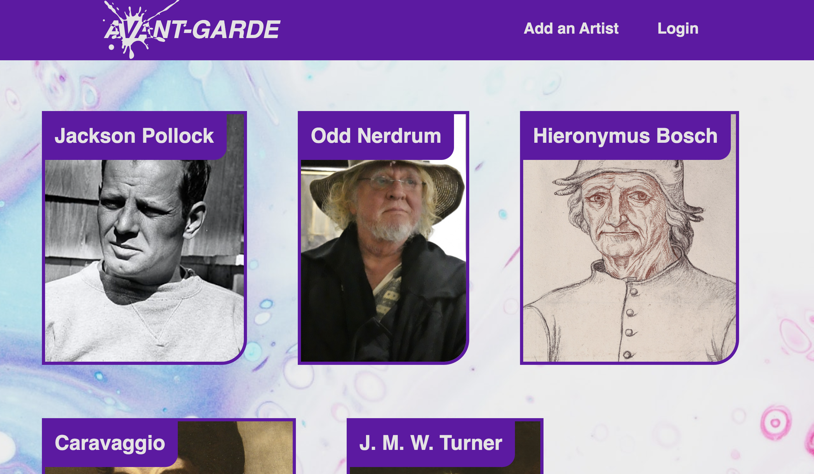
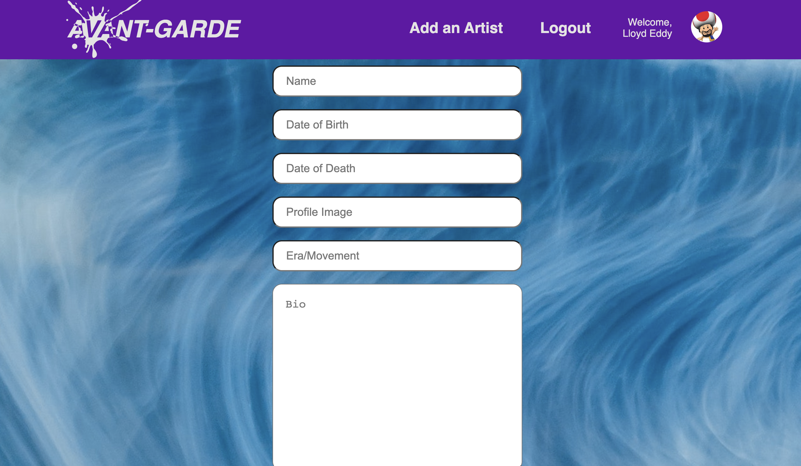

# **Avant-Garde**

This is a website to view, post, and share your favorite artists. A user, once logged in, can create their own artist entry. They can enter a variety of details about their artist, including:
- Artist name
- 5 images of their work (url's)
- Profile pic of the artist
- Date of birth/death
- Movement/era they worked in
- Bio

All these can be edited if the user is logged in. Also, a user can delete artist entries. Non-users can see this info, but can't edit/delete entries. Users can sign-in/sign-up with their Google account.

## *Technologies Used*
|       Front End      |       Back end      |
|:--------------------:|:-------------------:|
| - React              | - HTML              |
| - HTML               | - Css               |
| - Css                | - JavaScript/jQuery |
| - Sass               | - Node.js           |
| - Firebase           | - Express.js/ejs    |
| - Inkscape           | - Mongoose ODM      |
|                      | - MongoDB           |
| Deployed on  Netlify | Deployed on  Heroku |

## *Screenshots*

## *How to get Started*
[Click here launch](https://avantgardeartists.netlify.app/)

## *The Backend*
[Click here for the repo](https://github.com/lloddy/avant-garde-back)
[Click here for the page](https://avant-garde-backend.herokuapp.com/)

## *Future Enhancements*
- Users can only edit the posts they create
- Admin fucntionality to edit/delete all posts
